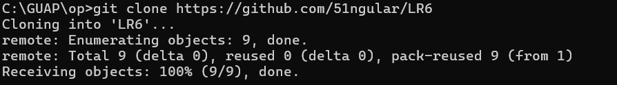

# Лабораторная работа №6

## 1. Цель работы

Изучение базовых возможностей системы управления версиями, опыт работы с Git Api, опыт работы с локальным и удаленным репозиторием.

## 2. Основная часть работы

### Форк репозитория

Создается копия репозитория в личное хранилище


### Настройка клиента git

Задается имя пользователя согласно требованиям, указанным в ЛР. 


### Клонирование репозитория на компьютер

Создается папка, в которую будет клонирован репозиторий. 



### Добавление файла через интерфейс GitHub

В личном репозитории необходимо воспользоваться кнопкой ```add file >> create new file. В основную ветку был добавлен текстовый файл file.txt.


### Подтягивание изменений в локальный репозиторий

Подтягиваем добавление нового файла в репозиторий на компьютере.


### История операций для каждой ветки

Далее необходимо получить историю операций для веток и просмотреть последние изменения. Первое осуществлялось с помощью команды git reflog branch_name, а второе - с помощью log.


### Слияние в одну ветку

Затем нужно выполнить слияние в ветку master. С помощью команды git merge branch_name ветки master и new_branch были объединены (содержимое new_branch появилось в ветке master).


### Удаление побочной ветки

После слияния двух веток, ветка new_branch удаляется.


### Создание файлов в локальном репозитории

Сначала создаётся первый файл File_1.txt.


Затем создаётся второй файл File_2.txt.


И наконец создаётся третий файл File_3.txt.


### Откат коммита

С помощью git revert HEAD --no-edit был осуществлен откат коммита.


### Создание ветки для отчета

Для отчета и демонстрации проделанной работы создается новая ветка report_branch.


## 3. Логи команд

В процессе выполнения лабораторной работы были использованы следующие команды:
cd ../../GUAP/op/
git clone https://github.com/51ngular/LR6
cd LR6
git config --global user.name "4315 Glukhov M. B."
git config --global user.email "51ngularyte@gmail.com"
ls -1
git pull
ls -1
git reflog
git log
git pull
git checkout new_branch
git pull
ls -1
git checkout master
ls -1
git merge new_branch
ls -1
git branch -d new_branch
echo "First file" >> File_1.txt
git status
git add File_1.txt
git status
git commit -m "Created first file."
git push
echo "Second file" >> File_2.txt
git status
git add File_2.txt
git status
git commit -m "Created second file."
git push
echo "Third file" >> File_3.txt
git status
git add File_3.txt
git status
git commit -m "Created Third file."
git push
gir revert HEAD --no-edit
git revert HEAD --no-edit


## 4. История операций в форматированном виде


## 5. Выводы

В ходе выполнения лабораторной работы были изучены базовые возможности системы управления версиями, получен опыт работы с Git Api, получен опыт работы с локальным и удаленным репозиторием.
```